# Bayora: Enterprise-Grade Isolated AI Security Laboratory

[](#architecture-the-4-pillars)
[](#1-sandbox-isolation)
[](#4-audit--evidence)
[](#2-policy-enforcement)

**Bayora** is an enterprise-grade AI security platform and evaluation laboratory. It provides a secure, isolated environment where a **Red Team** attacks a Client LLM, a **Blue Team** builds defense guardrails, and neither side can inspect the other's operational secrets (dual-blind evaluation).

---

## Architecture: The 4 Pillars

Bayora is built upon four architectural pillars engineered for zero-trust AI evaluation:

### 1. Sandbox Isolation
- **Zone Boundaries**: Separate zones for Red Team (`red_zone`), Blue Team (`blue_zone`), Client LLM (`llm_zone`), and Control Plane (`control_plane`).
- **Database Schemas**: Isolated PostgreSQL schemas (`control_plane`, `red_zone`, `blue_zone`, `llm_zone`, `audit_zone`) with service-level access revocations preventing cross-schema inspection.
- **Default-Deny Networking**: Kubernetes `NetworkPolicy` manifests drop all unauthorized ingress and egress traffic at the CNI layer.

### 2. Policy Enforcement
- **Server-Side RBAC**: Granular roles (`red_operator`, `blue_operator`, `admin`, `auditor`) verified on every API request.
- **Access Denial**: Cross-zone boundary attempts are immediately rejected with `403 Forbidden` (`ZONE_POLICY_VIOLATION`).

### 3. Security Events
- **Normalized Bus**: Real-time event normalization pipeline streamable via Server-Sent Events (SSE).
- **Dual-Blind Sanitization**:
  - **Red View**: Receives only model completions or a generic `"Request blocked by security policy."` message. Defense rule names, filter patterns, and detection IDs are strictly hidden.
  - **Blue View**: Receives tokenized telemetry categorized under OWASP LLM taxonomy (e.g. `LLM01: Prompt Injection`, `LLM02: Sensitive Info Disclosure`). Raw adversarial prompts and Red operator identities are redacted.

### 4. Audit & Evidence
- **SHA-256 Hash Chained Ledger**: Append-only cryptographic ledger where each block links to the previous block's SHA-256 hash:
  $$\text{Block\_Hash}_N = \text{SHA-256}(N \parallel \text{Timestamp} \parallel \text{Event\_ID} \parallel \text{Action} \parallel \text{Payload\_SHA256} \parallel \text{Block\_Hash}_{N-1})$$
- **Integrity Verification Engine**: Traverses the chain from Genesis (`0000000...`) to Head, re-computing all hashes to verify continuity.
- **Tamper Detection**: Altering any historical block triggers instant tamper detection, identifying the corrupted block index.
- **Cryptographic Export**: Verifiable JSON compliance package with digital verification seal for SOC2 and EU AI Act compliance.

---

## Gateway Pipeline

The Client LLM is reachable **strictly** through the 7-stage Gateway pipeline:

```
[Red Operator Payload]
         │
         ▼
 1. Auth (JWT Validation)
         │
         ▼
 2. Policy (RBAC Role Check)
         │
         ▼
 3. Rate Limit / Quota (RPM & Daily Token Bucket)
         │
         ▼
 4. Blue Input Filters (Regex, Heuristics, Canary Probing) ────► [BLOCK] ──► Generic Error to Red
         │ (Allowed or Sanitized)                                                 │
         ▼                                                                        ▼
 5. Client LLM Inference (Isolated Mock Persona)                         [Sanitized Blue Event]
         │                                                                        │
         ▼                                                                        ▼
 6. Blue Output Filters (Canary Leak & PII Interception) ────► [BLOCK]   [SHA-256 Audit Seal]
         │ (Allowed)
         ▼
 7. Security Event & Telemetry Generation
         │
         ▼
 8. SHA-256 Chained Audit Seal
         │
         ▼
[Response to Red Operator]
```

---

## Mermaid Architecture Diagram

```mermaid
flowchart TD
    subgraph RedZone["Red Team Zone (#E5484D)"]
        RedOp["Red Operator"]
        RedWorkbench["Attack Workbench"]
        RedCampaigns["Automated Campaigns"]
        RedHistory["Attack History (Isolated View)"]
    end

    subgraph Gateway["Enforcement Gateway Pipeline"]
        Auth["1. Auth (JWT)"]
        Policy["2. Policy (RBAC)"]
        Quota["3. Quota Guard"]
        InputFilters["4. Blue Input Filters"]
        OutputFilters["6. Blue Output Filters"]
        EventBus["7. Normalized Event Bus"]
    end

    subgraph BlueZone["Blue Team Zone (#3B82F6)"]
        BlueOp["Blue Operator"]
        DefenseBuilder["Defense Builder (Regex/Keywords)"]
        ThreatFeed["Sanitized Threat Feed (Redacted)"]
        Metrics["Defense Metrics & Recharts"]
    end

    subgraph LLMZone["Client LLM Zone (#8B5CF6)"]
        MockLLM["Mock LLM Engine (Airgapped)"]
        FinanceModel["Finance Core GPT-4 (Canary: 4091)"]
        ClinicalModel["Clinical Triage LLM (HIPAA)"]
        LlamaModel["Hardened Llama-3 8B"]
    end

    subgraph ControlZone["Control Plane Zone (#10B981)"]
        Admin["Administrator"]
        Sandboxes["Sandbox Manager"]
        Quotas["Quota & Rate Limiter"]
        UserMgmt["User & Key Management"]
    end

    subgraph AuditZone["Audit & Evidence Zone (#F59E0B)"]
        Auditor["Compliance Auditor"]
        HashChain["SHA-256 Hash Chain Ledger"]
        IntegrityVerifier["Chain Verification Engine"]
        EvidenceExport["Cryptographic Export Sealed"]
    end

    %% Networking flows
    RedWorkbench -->|1. Submit Payload| Auth
    Auth --> Policy --> Quota --> InputFilters
    InputFilters -->|Input Allowed| MockLLM
    InputFilters -.->|Input Blocked| EventBus
    MockLLM --> OutputFilters
    OutputFilters -->|Output Allowed| EventBus
    OutputFilters -.->|Canary Leak Blocked| EventBus
    EventBus -->|Dual-Blind Sanitized Stream| ThreatFeed
    EventBus -->|Cryptographic Append| HashChain
    EventBus -->|Generic Response| RedHistory

    %% Access Control
    Admin -->|Orchestrate| ControlZone
    Auditor -->|Verify Integrity| IntegrityVerifier
    IntegrityVerifier --> HashChain
    Auditor --> EvidenceExport

    %% Styling
    style RedZone fill:#E5484D15,stroke:#E5484D,stroke-width:2px
    style BlueZone fill:#3B82F615,stroke:#3B82F6,stroke-width:2px
    style LLMZone fill:#8B5CF615,stroke:#8B5CF6,stroke-width:2px
    style ControlZone fill:#10B98115,stroke:#10B981,stroke-width:2px
    style AuditZone fill:#F59E0B15,stroke:#F59E0B,stroke-width:2px
    style Gateway fill:#131E35,stroke:#475569,stroke-width:2px
```



---

## Pre-Configured Demo Accounts & Credentials

| Role | Username | Password | Assigned Zone | Console Route | Allowed Operations |
|---|---|---|---|---|---|
| **Red Operator** | `red_operator` | `red_pass123` | `red_zone` | `/red` | Submit attacks, run campaigns, view own attack history |
| **Blue Operator** | `blue_operator` | `blue_pass123` | `blue_zone` | `/blue` | Create defense rules, view sanitized threat feed, metrics |
| **Control Admin** | `admin` | `admin_pass123` | `control_plane` | `/control` | Provision sandboxes, edit quotas, manage policies & users |
| **Compliance Auditor** | `auditor` | `auditor_pass123` | `audit_zone` | `/audit` | Verify SHA-256 chain integrity, simulate tamper, export JSON |

---

## Quickstart Setup Steps

### Option A: Local Zero-Config Run (Recommended for Rapid Testing)

The platform runs out-of-the-box with SQLite and a built-in Mock LLM (no external API keys required):

#### 1. Start FastAPI Backend:
```bash
cd backend
python -m venv venv
# Windows: venv\Scripts\activate | macOS/Linux: source venv/bin/activate
pip install -r requirements.txt greenlet
uvicorn app.main:app --host 0.0.0.0 --port 8000 --reload
```
*API Swagger Documentation: [http://localhost:8000/docs](http://localhost:8000/docs)*

#### 2. Start Next.js Frontend:
```bash
cd frontend
npm install
npm run dev
```
*Web Application: [http://localhost:3000](http://localhost:3000)*

---

### Option B: Docker Compose Deployment

Launches Frontend, Backend, PostgreSQL 16 (with schema isolation), and Redis 7:

```bash
docker-compose up --build
```
- Frontend: `http://localhost:3000`
- Backend API: `http://localhost:8000`
- PostgreSQL: `localhost:5432` (Schemas: `control_plane`, `red_zone`, `blue_zone`, `llm_zone`, `audit_zone`)
- Redis: `localhost:6379`

---

### Option C: Cloud Kubernetes Deployment

Deploy into an isolated Kubernetes cluster:

```bash
# 1. Create Zone Namespaces
kubectl apply -f k8s/00-namespaces.yaml

# 2. Apply Resource Quotas per Zone
kubectl apply -f k8s/01-resource-quotas.yaml

# 3. Apply Default-Deny NetworkPolicies
kubectl apply -f k8s/02-network-policies.yaml

# 4. Deploy Gateway, Services & Ingress
kubectl apply -f k8s/03-deployments.yaml
```

---

## Running the Automated Test Suite

Bayora includes comprehensive backend tests proving:
1. Unauthenticated callers are rejected (`401 Unauthorized`).
2. Red operators cannot access Blue defense rules or threat feeds (`403 Forbidden`).
3. Blue operators cannot access Red attack payloads or campaigns (`403 Forbidden`).
4. Dual-blind attack interception: Red sees only generic blocked messages, Blue sees only sanitized snippets.
5. SHA-256 hash-chain integrity verification and tamper detection.

To run the test suite:
```bash
cd backend
pytest tests -v
```

Expected output:
```text
tests/test_zone_isolation.py::test_unauthenticated_access_denied PASSED  [ 20%]
tests/test_zone_isolation.py::test_red_cannot_access_blue_zone PASSED    [ 40%]
tests/test_zone_isolation.py::test_blue_cannot_access_red_zone PASSED    [ 60%]
tests/test_zone_isolation.py::test_dual_blind_attack_and_block PASSED    [ 80%]
tests/test_zone_isolation.py::test_audit_hash_chain_integrity PASSED     [100%]
============================== 5 passed in 8.07s ==============================
```

---

## Platform Pages Overview

1. **Landing Page (`/`)**:
   - Interactive 4-Pillar Overview.
   - Interactive Architecture Diagram with clickable zone inspection and pipeline stage latency metrics.
   - One-click launchpad for all operator consoles.

2. **Login & Role Switcher (`/login`)**:
   - Fast demo role switcher to test RBAC enforcement across all 4 roles.
   - Manual authentication with JWT bearer tokens.

3. **Red Console (`/red`)**:
   - **Attack Workbench**: Adversarial vector presets (Direct Injection, DAN Jailbreaks, Canary Probes), sandbox selector, and gateway submission.
   - **Campaigns**: Automated red-teaming batch evaluations with progress tracking.
   - **Attack History**: Dual-blind isolated log (Red never sees which Blue defense fired).

4. **Blue Console (`/blue`)**:
   - **Defense Builder**: Rule engineer for regex, keyword, canary guard, and entropy filters.
   - **Sanitized Threat Feed**: Live telemetry classified by OWASP LLM taxonomy with raw attack payloads masked.
   - **Metrics**: Interactive Recharts graphs displaying block rates and taxonomy distributions.

5. **Control Plane (`/control`)**:
   - **Sandboxes**: Provision isolated evaluation targets (`sbx-finance-prod`, `sbx-clinical-ai`, `sbx-llama3-hardened`).
   - **Quotas**: Rate limiting and token budget management.
   - **Policy Matrix**: RBAC cross-zone boundary definitions.
   - **Users**: Identity management and credentials.

6. **Audit & Evidence (`/audit`)**:
   - **SHA-256 Hash Chained Ledger**: Block-by-block immutable record with cryptographic hash links.
   - **Verify Integrity**: Recalculates all hashes from Genesis to Head.
   - **Simulate Tamper**: Mutates a database block to prove cryptographic detection catches tampering.
   - **Export Evidence**: Downloadable signed JSON audit certificate.

7. **Observability Dashboard (`/observability`)**:
   - 7-Stage pipeline latency profiler.
   - Cross-zone network traffic matrix.
   - Distributed cache metrics.

8. **Demo Walkthrough (`/demo`)**:
   - Step-by-step interactive simulator: Attack → Block → Sanitized Blue Event → Auditor Verification.
   - Side-by-side comparison of Red, Blue, and Auditor perspectives.

9. **OWASP LLM Vulnerability Taxonomy (`/taxonomy`)**:
   - Comprehensive interactive directory of the OWASP Top 10 for Large Language Applications.
   - CWE mappings, severity classifications, sanitized attack payload vectors, and live Blue Team guardrail crosswalk.

10. **Client AI Model Security Dossiers (`/models`)**:
    - Enterprise model comparison cards across `Client-Finance-GPT-4`, `Client-Healthcare-LLM`, and `Llama-3-8B-Secured`.
    - Canary token registries, safety benchmark scores, and zone isolation parameter matrices.

11. **Regulatory Compliance & Assurance Hub (`/compliance`)**:
    - Real-time audit assurance mapping for EU AI Act (Regulation 2024/1689), SOC 2 Type II, and NIST AI RMF 1.0.
    - Article-by-article compliance status, SHA-256 evidence trail verification, and signed JSON attestation package export.

12. **Operational Configuration & Settings (`/settings`)**:
    - Centralized platform configurations: General, Workspace sandboxes, API gateway, Target models, Dual-blind security policies, SIEM webhooks, and UI themes.

---

## Enterprise Design System (Pro Max Architecture)

Bayora features a custom enterprise design system engineered for high-assurance cybersecurity platforms (Linear, Datadog, Stripe, Cloudflare quality standards):

### 1. Palette & Surfaces
- **Primary Background**: `#070A0F` (Deep graphite)
- **Secondary Background**: `#0B1017`
- **Surface**: `#101720`
- **Elevated Surface**: `#151D27`
- **Border**: `#25303C`
- **Subtle Border**: `#1B252F`
- **Semantic Accents**:
  - Cyan (`#39D9FF`): Primary interactive elements & system triggers
  - Violet (`#8C7DFF`): Target LLM intelligence & model card features
  - Green (`#38D996`): Healthy state, unbroken cryptographic proofs, normal flow
  - Amber (`#FFB84D`): Warnings, canary token disclosures, SHA-256 ledger seals
  - Red (`#FF6074`): Critical prompt injections, policy blocks, tamper detection
  - Blue (`#5D9CFF`): Informational telemetry & OWASP classifications

### 2. Typography Scale
- **Headings**: `Space Grotesk` (Engineered, geometric tracking)
- **Body UI**: `Inter` (Legible, accessible, balanced optical hierarchy)
- **Technical Data**: `JetBrains Mono` (Block hashes, JWT tokens, attack payloads, latencies)

### 3. Application Shell & Interaction Systems
- **Permanent Desktop Sidebar**: Categorized navigation (`Core Modules` and `Assurance & Hub`), live mTLS mesh heartbeat indicator, and quick user session switcher.
- **Top Bar**: Real-time breadcrumb tracking, environment chip (`SANDBOX / SIMULATED`), global status pill (`SYSTEM SECURE`), and Command Palette trigger.
- **Global Command Palette (`Cmd + K` / `Ctrl + K`)**: Instant keyboard-driven search modal across all routes, models, threat vectors, audit proofs, and settings.
- **Slide-Over Detail Drawers**: Non-disruptive inspection drawers for deep dive telemetry, raw canonical JSON previews, and verification certificates.
- **Zero-Trust Topology Map**: Interactive service flow diagram connecting `CLIENT -> FRONTEND -> GATEWAY -> MODEL -> DATABASE`.

